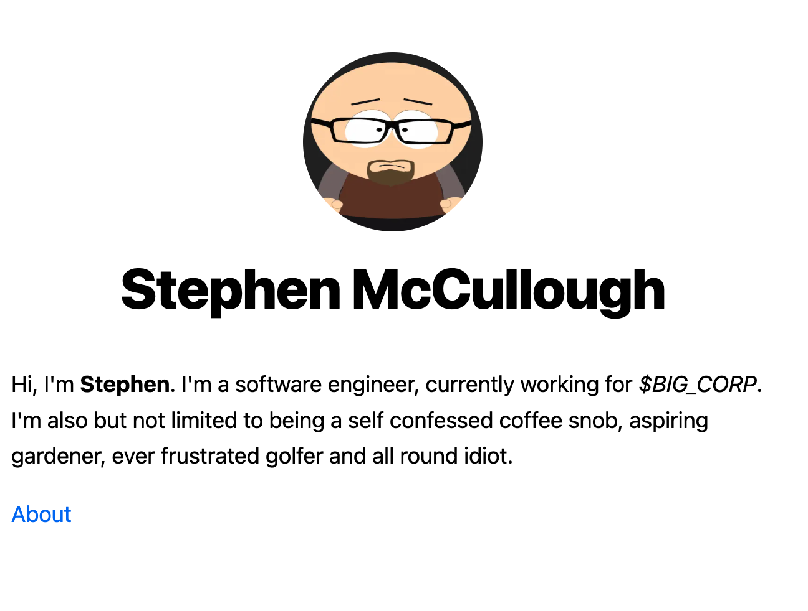

# swm.cc

## Description

My web site. At the time of writing a work in progress.

I am building it publicly and will fill out this README as development
progresses.

I'm building this site using [Next.js](https://nextjs.org/) and learning as I go, so if you see anything that could be improved, please let me know (via a PR or an Issue).

## Development Info

[Site](https://swmcc.vercel.app/)

I intend to use the GitHub eco system for project management and workflow.

[ISSUES](https://github.com/swmcc/swm.cc/issues)
